# **Mindfulness**

[View the live project here](https://ciaraosull.github.io/project-1-mindfulness/index.html)

Mindfulness is a website designed for a not-for-profit organisation called be.here.now.  This site aims to provide free mindfulness education and resources to adults.  The site is targeted towards those who have very little knowledge of mindfulness and wish to learn more.  It will also give an introductory mindfulness audio session where users can try out mindfulness to see what it is like.  There is the opportunity for users to sign up to monthly emails supporting them with further learning and practice.  Also, there will be links for the users to have access to downloading the app where they can continue their mindfulness practice.
 

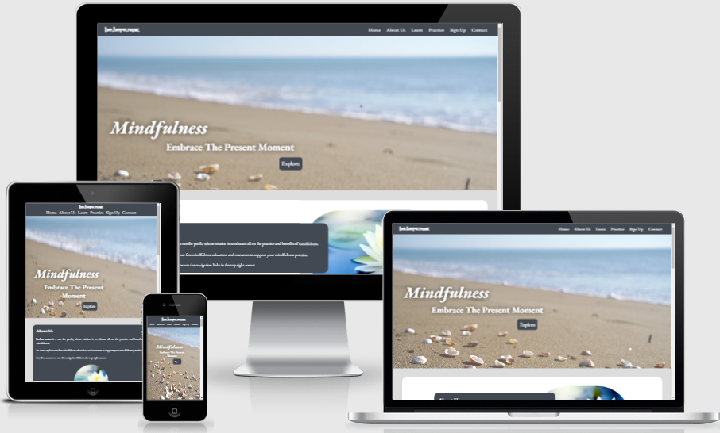

 

## Features
1. **Favicon**
    * A favicon was generated by uploading a lotus flower logo to [Favicon Generator](https://realfavicongenerator.net/).  This then generated a 16x16 icon that was saved in the assests images folder and linked in the head section of the html.
    * A favicon consistant with the theme of mindfulness was chosen to be asscociated with this website as an extra visual support for the user and to create a positive user experience.  It should create brand awareness and recognizability for the user visually and help them find the page quicker and easier.

    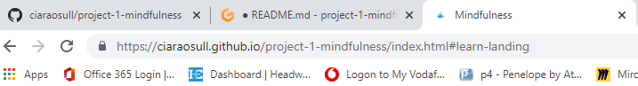

2. **Header**

    The header is intentionally fixed to the top of the screen.  As this website contains one page with many sections, this fixed header design, is useful to the user to navigate with ease without having to constantly scroll up and down.  The colour choice of dark gray for background and white for the font was chosen to contrast each other for reading accessibility.  

    * Logo
        * The header contains the logo on the top left for larger screens and is adjusted to top center for smaller screens for responsiveness.  

        * The logo is linked to the landing page for ease of navigation for the user, no matter what section they are on they can click the logo in the top left to navigate back.  

        * The logo, when hovered over, responds by expanding slightly to inform the user that it is interactive.
        
        * The logo is also in a different font to the rest of the website.  This is to help it stand out as a logo from the rest of the text and also for consistancy thoughout the site the same font is used whenever the logo name appears.

    * Navigation Bar
        * The header also contains the navigtion bar.  This is conventionally located on the top right for larger screens and is adjusted to center, under the logo, for smaller screens to aid responsiveness.
        
        * The navigation bar contains key words that link to each section of the website.  Again this is designed to for ease so the user can navigate instantly without having to scroll, if they wish.

        * The navigation links, when hovered over, respond by expanding slightly to inform the user that it is interactive.  A white line also appears under the word that has been clicked to inform the user that they are currently on that section.

        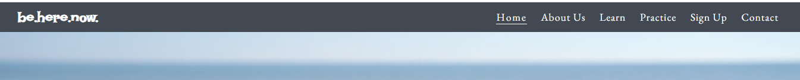

3. **Landing Page**

    * A video was carefully chosen as a background image to make the landing page stand out from other websites. 

    * This specific video was chosen as the movement is only in the top of the video and slightly blurred so as not to distract the user too much while they are reading.  The video is on loop and muted so that it is not interactive and stays as a background feature for the user.

    * The video was also chosen as it ilicits a calming effect and compliments the theme of the website.

    * The video is fixed into position so that it disapppears as the user continues to the main content so that it does not become too distracting as the amount of text to read increases.

     * The landing page also contains the title of the website and its subtitle.  A white font with a drop gray shadow was used for contrast for reading accessibility and consistancy with colours used in the header.
    
    * The landing page was designed not to show any hint of content below to allow the background video to have the effect of calm and the landing page to be decluttered for the user before they continued with the site.  Again, this calming and decluttered effect compliments the theme of mindfulness.  Because of this design feature then, an explore button linked to the first section, called About Us, was added.  This explore button's aim is to invite the user to interact and encourage them to continue on reading.  The user can also scroll but the explore button adds an extra feature incase the instinct to scroll does not happen when there is no hint of content below the landing page.

    * The explore button letters are white on a gray background, for not only contrast for reading accessibilty but also keeping consistant with the main colours chosen thorughout the website.  The letters also expand when hovered over and the colours of white text on gray back ground alternate to gray letters on white background to inform the user that the button is interactive.

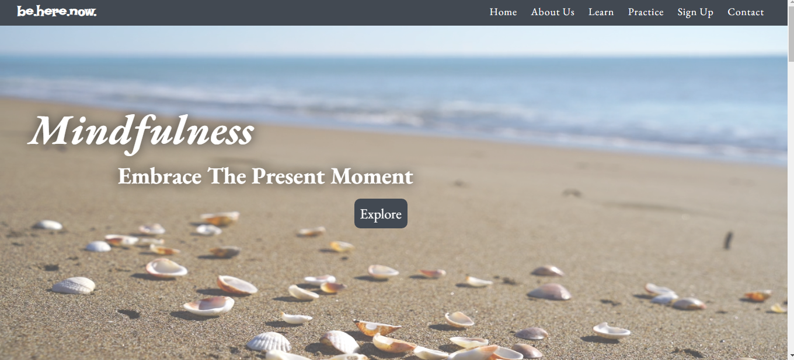

4. **About Us Section**
* The About Us section contains important information the user needs to know about the organisation and the purpose.  

* It also gives the user a brief summary of what this website is about and directs them to scroll or use the navigation bar for the rest of the content on the site.

* The background colour used was the dark gray to keep consistancy throughout the site with the header and footer.  The font is whote for contrast and again consistancy with the rest of the site.

* The text and the image are over lapped slightly for visual appeal and uniqness to taxt and image side-by-side.

* A media query was used for responsiveness on smaller screens to take out an extra white background.  his seemed to be visually more appealing on a smaller screen with less clutter.

* Also on smaller screens, the image is set to become a circle as again this seemed more appealing and not as cluttering on smaller screens. 

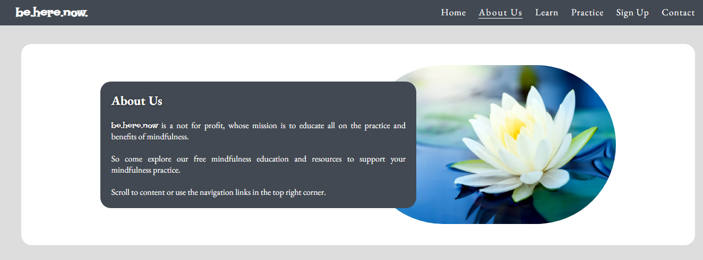

5. **Learn Section**

* The Learn section consists of 2 subsections.  The first provides information on what mindfulness is and the second provides an overview of the benefits of mindfulness.

* Both subsections were designed to compliment the About Us section with minor differences such as the images and a quote in bolder writing.

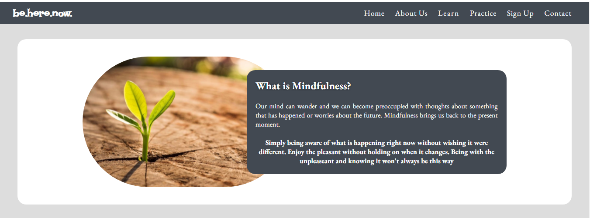

 

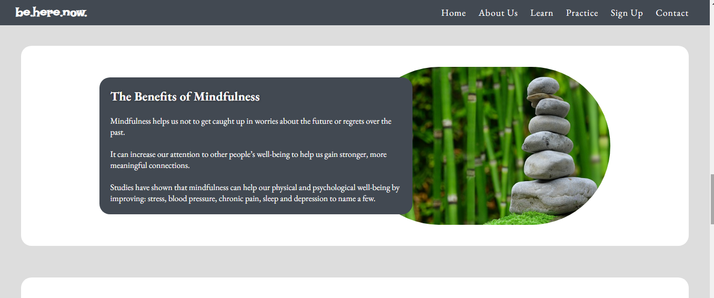

6. **Practice Section**

* The Practice section of the website instructs the user how to get set up before pressing play on an imbedded audio mindfulness session.  The user is told how long the session will take and the title of the recording.  The audio controller is not on auto-play so the user has full control over this interactive piece.

* This Practice section was designed to compliment the About Us & Learn sections with minor differences such as the images and the audio control.

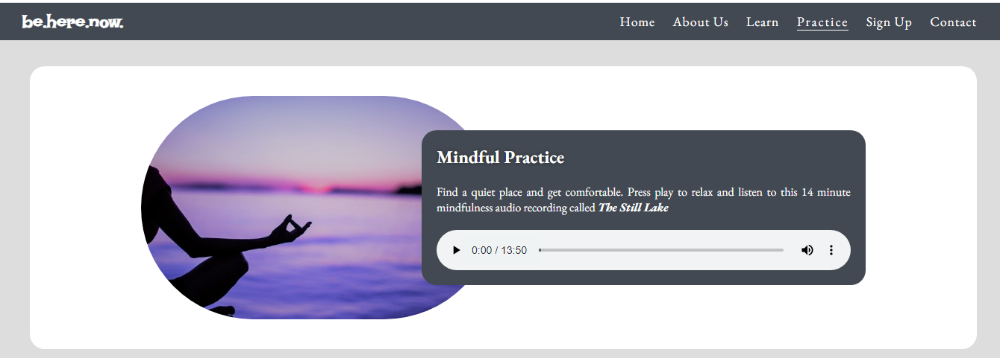

7.  **Sign Up Section**
    * The Sign Up section contains a form and information explaining to the user that if they would like to recieve a monthly subscription by email for free then they can complete the form.  The option to choose if they would like to sign up to an online mindfulness group iin the future is also given on the form.  The user is also informed how to unsubscibe in the future if the wish to do so.

    * The form is set on a pictured background to enable it to stand out as a separate section from the rest of the webpage but the image and colour scheme are kept consistant with the theme and design of the overall site.  The areas of input change colour on hover and the submit but also changes colour and the letter spacing grows on hover.  This is all designed to give feedback to the user visually on their actions.

    * The form is designed to make the name and email sections, required and will give feedback to the user if this is not completed correctly.  Once the form is submitted the user is taken to a thank-you page were they are informed that they have submitted their details and explained to again how they can unsubscribe if needed.  

    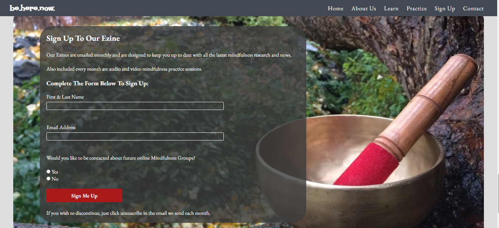

    * The thank-you page design is kept consistant in style and image to the rest of the site and the same header, nav and footer are present.  This allows the user to navigate back to any section of the wesite with ease, if they choose.

    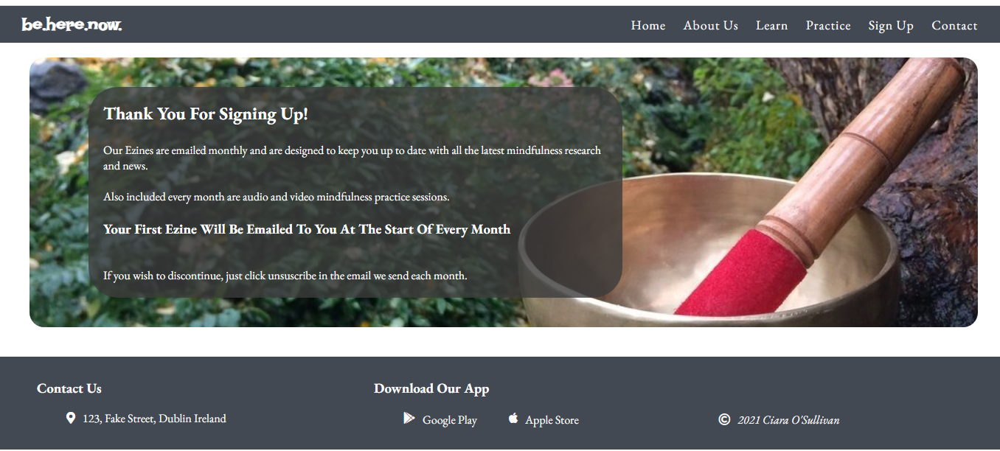

8.  **Contact Us Section**
    * The Contact Us Section is set within the footer.  The background and font colours are kept consistant with the theme of the header.  This section is responsive and flexbox was used in this section, just as in the header, to ensure the section changes from row to column display as screen sizes reduce.
    
    * The address is a link to Google Maps to show the location of the organisation.  This link opens for the user in a new tab.  There is also a font awsome icon of a location marker to visually aid the user.

    * The address font and icon change colour and the letter spacing increases on hover to give feedback to the user that it is a clickable link and an action can be preformed.

    * The Contact Us Section also contains information on downloading the organisations app.  The Play Store and Apple Store words open in a new tab and take the user to the respective sites to locate the app to download.  There are also font awesome icons for the Play Store and Apple store to visually aid the user.  

    * The Play Store and Apple Store fonts and icon change colour and the letter spacing increases on hover to give feedback to the user that it is a clickable link and an action can be preformed.

    * The Contact Us Section also contains a copyright font awesome icon and the authours name.  The words are linked to the authors Linkin page on a new tab for the user to contact the author if needed.  This copyright section font and icon change colour and the letter spacing increases on hover to give feedback to the user that it is a clickable link and an action can be preformed.

    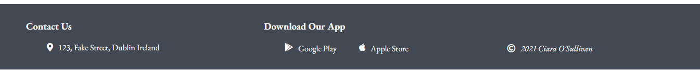

9. **Page Not Found - 404 Page**
    * A customised 404 page not found was added to the site to support the professionalism design and ensure appropriate link was added back to the main site to guide users who come across this message.

    * An image from the website is used for consistancy and the link back to the main website has a line underneath and letter spacing on hover to provide feedback to the user.  Inline css was used within the 404.html page to prevent further errors being shown if the style sheet fails to load from a link.

    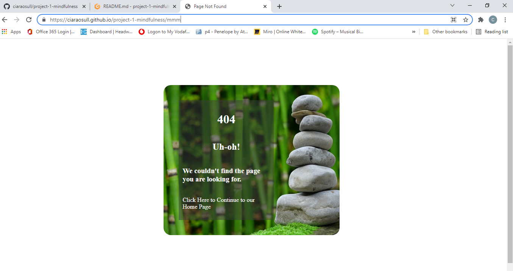

## Languages Used
---

## Frameworks, Libraries and Programmes
---

## Testing
---
* Bugs – Fixed & Unfixed

1. Sign Up Section:

Originally the form had an input submit button, a method of POST and an action of the Code Institue Form Dump site.  But it was found on testing that it became annoying and difficult for users as once they submitted their form they were taken to the Code Institue webpage explaining what they had submitted.  
    
For ease of use on the user it was decided to take out the method and action and replace the input button with an anchor tag linked to a Thank You Page instead.  This page was designed to give feedback to the user on the action they completed.  However, this then resulted in the name and email elements of the form not showing as required.  

This error was corrected by placing the method of "get" and the action as the "thank-you.html and the input submit button was put back instead of a link. 

* Validator Testing

1. The [W3C](https://validator.w3.org/) site was used to validate the **HTML** code.

    It returned 2 errors and a warning on the index.html page.  The break points used in the Benefits section of the Learn section were removed and the Main Content Container class selector was changed from a section to a div.  The validator was rerun and came back clear.  
    
    The W3C html validator also showed a stray end section tag in the thank-you.html page and this was resolved. 

    The W3C validator returned no errors on the 404.html page.

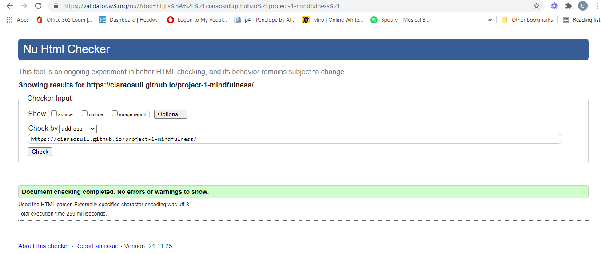

2. The [W3C](https://validator.w3.org/) site was also used to validate the **CSS** code.

    It returned no errors on the style.css file or the 404.html file, which contains it's own css.

    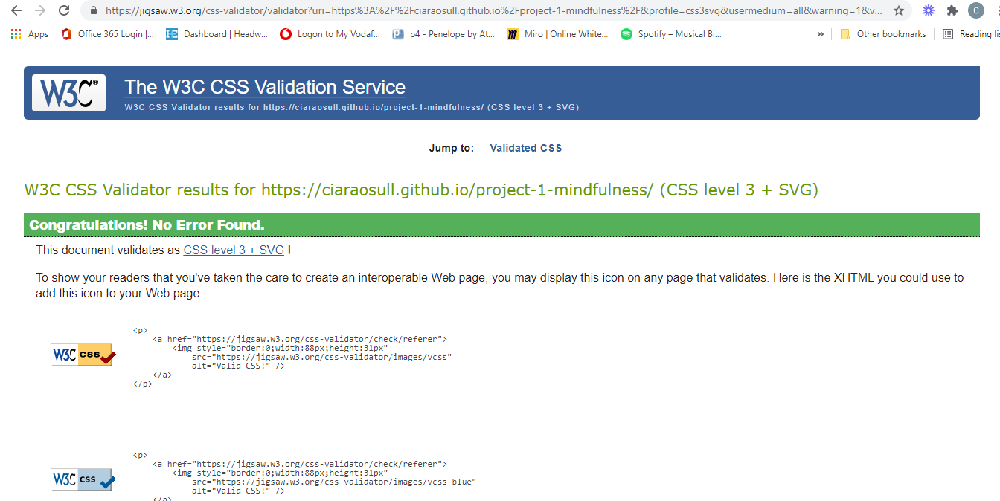

3. **Lighthouse** was accessed through Developer Tools in Chrome to check the site for performance, acessibility, best practice and SEO.  The first time this was run, the performance score was 88%.  Lighthouse suggested to change some larger images from jpg to avif, which was done.  However, it seemed that the Chrome extensions that were installed in the testing laptop were also having an effect on the performance score Lighthouse was rendering.  The test was redone incognito window and performance scores rose to 99%.  

    Acessibility is at 100%, so no changes needed.

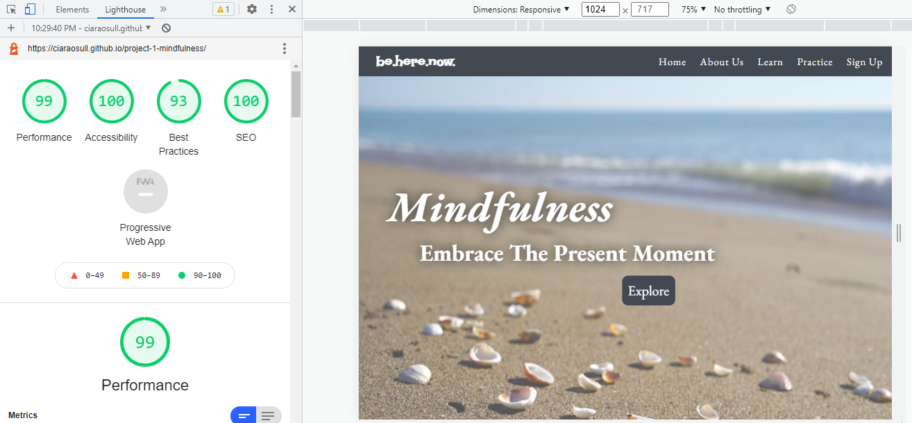

## Deployment
---

## Credits 
* Content
* Media

## Acknowledgements

