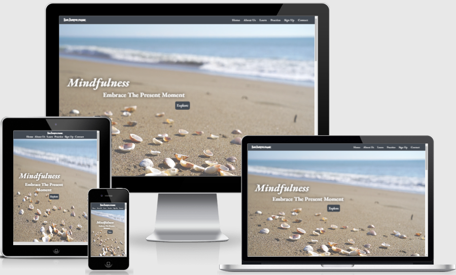

# **Mindfulness**

[View the live project here](https://ciaraosull.github.io/project-1-mindfulness/index.html)

Mindfulness is a website designed for a not-for-profit organisation called **be.here.now**.  This site aims to provide free mindfulness education and resources to adults.  The site is targeted towards those who have very little knowledge of mindfulness and wish to learn more.  It will also give an introductory mindfulness audio session where users can try out mindfulness to see what it is like.  There is the opportunity for users to sign up to monthly emails supporting them with further learning and practice.  Also, there will be links for the users to have access to downloading the app where they can continue their mindfulness practice.
 

 

## Features
---

* Navigation

* Header

* Landing Page

* About Us Section

* Learn Section

* Practice Section

* Sign Up Section

* Contact Us Section

 

## Languages Used
---

## Frameworks, Libraries and Programmes
---

## Testing
---
* Bugs – Fixed & Unfixed

* Validator Testing

## Deployment
---

## Credits 
* Content
* Media
---
## Acknowledgements
---

